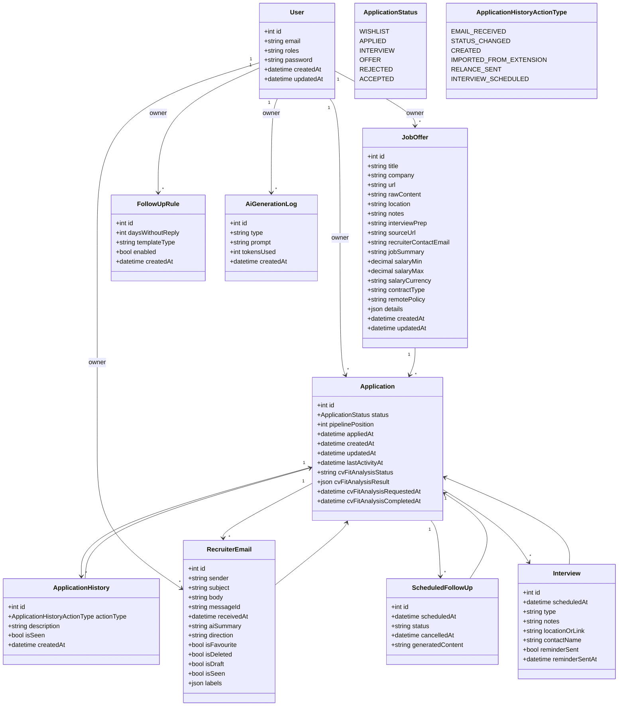

# Data Model

# Explications des entitées
## User
- Compte candidat
- Owner de toutes les données (multi-tenant simple)
- Utilisé pour auth et filtrage global

## JobOffer
- Offre d’emploi
- Peut venir de l'extension (import) ou d’un ajout manuel
- Contient :
  - données métier (title, company, salary…)
  - contenu brut (`rawContent`) pour reprocessing
  - enrichissements (`jobSummary`, `interviewPrep`)
- Relation : 1 JobOffer → N Applications

## Application
- Entité centrale du système
- Représente une candidature utilisateur pour une offre
- Contient :
  - état (`status`, `pipelinePosition`)
  - dates (`appliedAt`, `lastActivityAt`)
  - données IA (analyse CV)
- Agrège :
  - historique
  - emails recruteur
  - interviews
  - relances
- Source principale de vérité métier

## ApplicationHistory
- Timeline des événements d’une candidature / notifications utilisateurs
- Types :
  - création
  - changement de statut
  - email reçu
  - entretien planifié
  - relance envoyée
- Contient :
  - description optionnelle
  - flag `isSeen` (notifications)
- Sert pour UI, notifications et debug

## RecruiterEmail
- Email synchronisé depuis la boîte mail
- Source externe de vérité
- Contraintes :
  - unique `(messageId + owner)`
- Contient :
  - contenu (`body`)
  - metadata (`sender`, `subject`, `receivedAt`)
  - flags UI (`isSeen`, `isFavourite`, etc)
  - résumé IA (`aiSummary`)
- Peut déclencher :
  - mise à jour activité
  - création d’historique

## FollowUpRule
- Règle utilisateur pour automatiser les relances
- Définit :
  - délai sans réponse (`daysWithoutReply`)
  - type de template
  - activation
- Sert d’input pour génération de relances

## ScheduledFollowUp
- Relance planifiée concrète
- Cycle :
  - pending → sent → cancelled
- Contient :
  - date d’envoi
  - contenu généré
- Sert de buffer entre règle et envoi réel

## Interview
- Entretien lié à une candidature
- Contient :
  - date (`scheduledAt`)
  - type (visio, tel, présentiel)
  - lieu ou lien
  - contact
  - notes
- Gère aussi les rappels (`reminderSent`)

## AiGenerationLog
- Log des appels à l’IA
- Contient :
  - type d’usage
  - prompt
  - tokens consommés
- Sert pour :
  - monitoring coût
  - debug
  - analytics

## UserMailboxSettings
- Configuration mail utilisateur
- Contient :
  - IMAP (sync réception)
  - SMTP (envoi emails)
  - OAuth (tokens, expiration)
- Sert pour :
  - synchronisation des emails
  - envoi des relances
