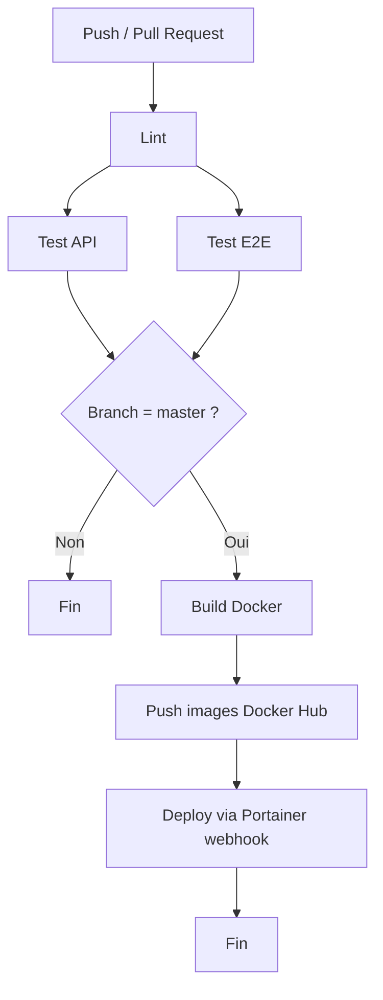
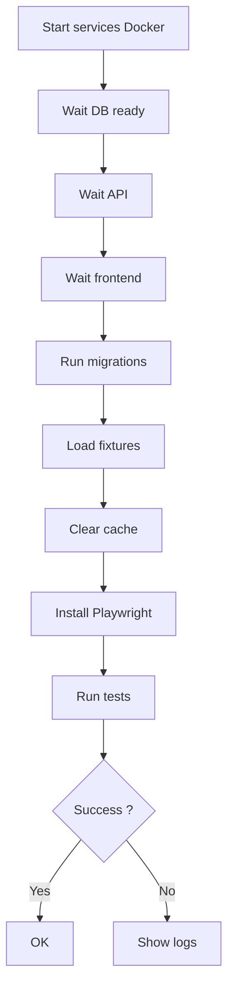
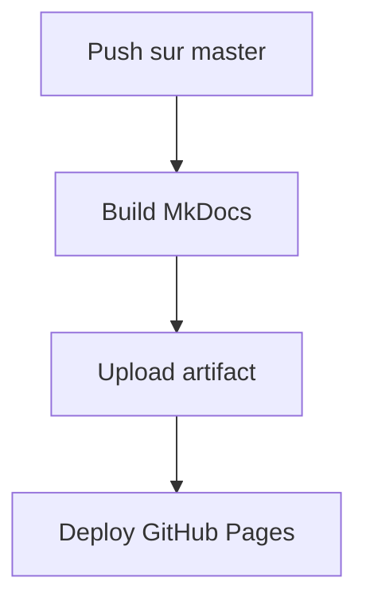
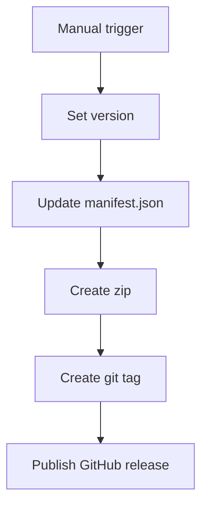

# CI/CD - Flux global

## Pipeline principale

```mermaid
flowchart TD

    A[Push / Pull Request] --> B[Lint]

    B --> C[Test API]
    B --> D[Test E2E]

    C --> E{Branch = master ?}
    D --> E

    E -->|Non| F[Fin]

    E -->|Oui| G[Build Docker]

    G --> H[Push images Docker Hub]

    H --> I[Deploy via Portainer webhook]

    I --> J[Fin]
```

## Détail du job E2E

```mermaid
flowchart TD

    A[Start services Docker] --> B[Wait DB ready]
    B --> C[Wait API]
    C --> D[Wait frontend]

    D --> E[Run migrations]
    E --> F[Load fixtures]
    F --> G[Clear cache]

    G --> H[Install Playwright]
    H --> I[Run tests]

    I --> J{Success ?}

    J -->|Yes| K[OK]
    J -->|No| L[Show logs]
```

## Déploiement de la documentation

```mermaid
flowchart TD

    A[Push sur master] --> B[Build MkDocs]
    B --> C[Upload artifact]
    C --> D[Deploy GitHub Pages]
```

## Release extension

```mermaid
flowchart TD

    A[Manual trigger] --> B[Set version]
    B --> C[Update manifest.json]
    C --> D[Create zip]

    D --> E[Create git tag]
    E --> F[Publish GitHub release]
```
